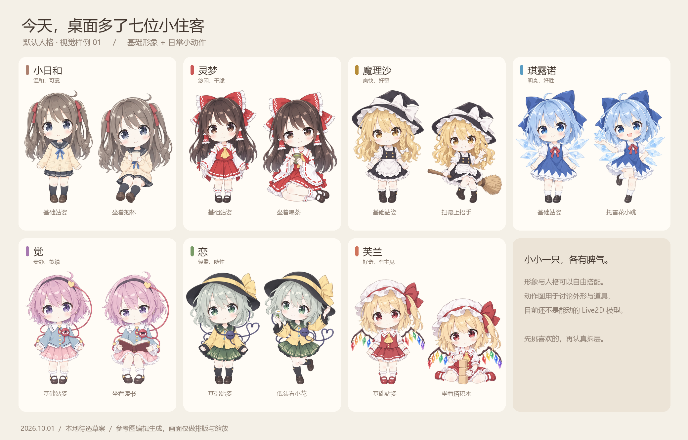

# AIPet · 小体型桌宠视觉草案

这个分支保存七位默认角色的 **14 张静态原画样例**：每人一张基础站姿、一张活动姿态。先确定外形，再进入 Live2D 拆层与绑定。

**[查看样例与制作说明](docs/desktop-pet-concepts/README.md)** · **[查看设计纲领](docs/desktop-pet-concepts/DESIGN.md)** · **[回到 main 使用指南](https://github.com/xingyichen069-ctrl/AIPet/blob/main/README.md)**

## 打开互动预览

GitHub 仓库页面可以查看图片和文档，但不会运行 HTML 里的按钮。要切换姿态、调节大小和深浅背景：

1. [下载本分支 ZIP](https://github.com/xingyichen069-ctrl/AIPet/archive/refs/heads/design/chibi-pet-concepts.zip) 并完整解压。
2. 进入 `docs/desktop-pet-concepts`。
3. 双击 `打开预览.bat`，或用浏览器打开 `review/index.html`。无需安装 Python、配置 API 或启动桌宠。

## 这条分支的范围

- 保留人物识别特征，探索精致二次元 Q 版的小全身和生活姿态。
- 人格与皮套独立；换形象时是否同时换人格，由用户选择。
- 预览提供 120–260 像素范围，默认 180；安静、日常、活泼、漫游是后续行为设计。
- 对话面板和右键主列表保持既定方向，未来设置集中放进“外观”内部。

本分支继承 main 的应用基础 `0.5.0-beta.2`，仅新增视觉资料与说明。图片尚未成为可用的 Live2D 模型，应用没有接入新皮套或四种动态模式。

原图、提示词、出处及当前限制见 [样例说明](docs/desktop-pet-concepts/README.md)。日常安装请使用 [main](https://github.com/xingyichen069-ctrl/AIPet/tree/main)。
