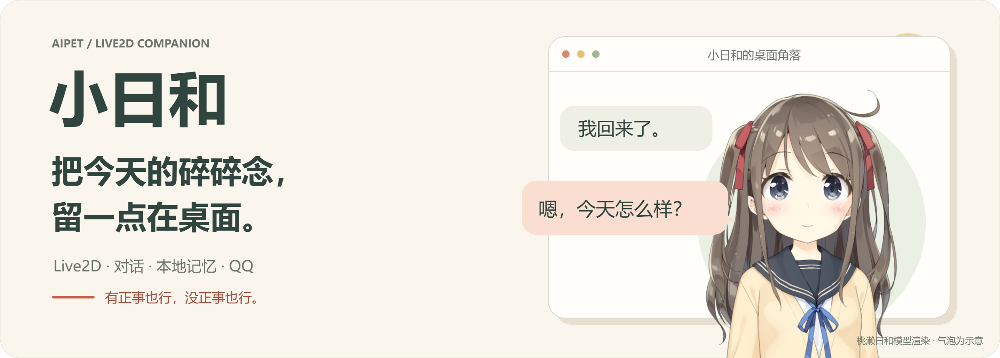
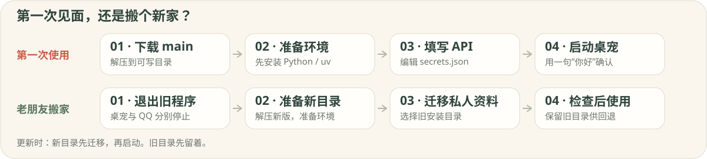
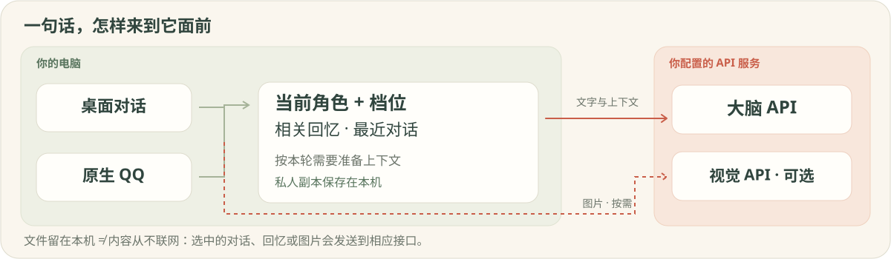

<picture>
  <source media="(max-width: 640px)" srcset="docs/assets/readme-cover-mobile.png">
  
</picture>

<p align="center">
  <strong>桌面留个位置，想说话时就叫她。</strong><br>
  <code>0.5.0-beta.3</code> · Windows 10/11 x64 · Python 3.11–3.14 · macOS 实验性
</p>

<p align="center">
  <a href="https://github.com/xingyichen069-ctrl/AIPet/archive/refs/heads/main.zip"><strong>↓ 下载 main</strong></a>　·　
  <a href="#第一次使用windows">第一次见面</a>　·　
  <a href="#从旧版本更新">老朋友搬家</a>　·　
  <a href="#文档">说明书</a>　·　
  <a href="CHANGELOG.md">施工日志</a>
</p>

## 今天，从一句「我回来了」开始

小日和默认使用 **Live2D 桃濑日和**。聊今天的小事、接着上次的话题，也可以改写角色的 SOUL，让相处的方式慢慢贴近自己的习惯。

- **碎碎念有地方放。** 对话历史与记忆保存在本机，聊天时会检索相关回忆；也能在内置 QQ 通道里接着聊。
- **正事也能搭把手。** 看图、读 Word、约个提醒。图片识别需要视觉接口，提醒需要程序保持运行。
- **桌面按你的喜好来。** 六套昼夜主题，字号与通透度可调；外观和人格分别选择。

> 先让她回一句“你好”，其他的慢慢来。首次只需配好大脑 API；选中的对话与回忆会发送给你配置的服务。

<picture>
  <source media="(max-width: 640px)" srcset="docs/assets/readme-routes-mobile.svg">
  
</picture>

## 第一次使用：Windows

**准备一台 Windows 10/11 x64 电脑，以及可用的大脑 API 密钥。** 主指南使用 DeepSeek。Python 支持 **3.11–3.14 x64**，准备程序优先选择 **3.12**，也可使用 uv；原生 ARM64 和 32 位 Python 不在当前支持范围内。

### 01 · 下载，给她留个位置

[下载 main 源码 ZIP](https://github.com/xingyichen069-ctrl/AIPet/archive/refs/heads/main.zip)，完整解压到可写目录，例如 `D:\AIPet`。进入能看到 `README.md`、`准备环境.bat`、`src` 和 `data` 的那一层。

不要在压缩包预览里直接运行，也不要放进 `Program Files` 等需要管理员权限的目录。源码包不含 Python 环境、密钥或私人资料。

### 02 · 准备环境，把小屋搭好

1. 没有 Python 或 uv 时，先安装 [Python 3.12 Windows 64 位版](https://www.python.org/downloads/windows/)，勾选 **Add python.exe to PATH**。已有受支持版本或 uv 可跳过。
2. 双击 **准备环境.bat**，等待环境和配置检查结果。首次需要联网下载依赖，通常为数百 MB。
3. 失败时保留错误窗口，按 [Windows排查说明](Windows使用说明.md) 处理。再次运行会保留已填写的配置。

准备成功会生成 `data/secrets.json`、`data/config.json` 和 `data/thinking.json`。**填写密钥的文件叫 `secrets.json`，末尾有一个 s。**

### 03 · 填写 API，接上话题

双击 **配置API.bat**，会用记事本打开 `data/secrets.json`。找到 `deepseek_api_key`，把它后面英文双引号里的内容换成自己的 key，其他字段先不动。

按 **Ctrl+S** 保存，再双击 **检查配置.bat**。检查只看本地格式和填写状态，不联网验证，也不显示密钥；能否正常回复，在下一步确认。

<details>
<summary>不知道填在哪里？展开看配置示例</summary>

```json
{
  "deepseek_api_key": "在这里填写你自己的key",
  "deepseek_base_url": "https://api.deepseek.com",
  "model": "",
  "vision_api_key": "",
  "vision_base_url": "",
  "vision_model": "",
  "qq_appid": "",
  "qq_secret": ""
}
```

这是结构示例，示例文字不能当作 key。实际文件里带 `_` 的说明可以保留；**已有配置只改对应值，不要用示例覆盖整份文件。**

使用英文双引号和逗号，最后一项后不加逗号，不加 `//` 注释。编辑没有 `.example` 的本机文件，不要把 key 填进公开模板，也不要发出填好的文件。

`secrets.json` 管接口凭据，`config.json` 管程序设置，`thinking.json` 管档位与模型。准备环境不会生成人格库，更新用户可以先迁移再启动。

</details>

### 04 · 启动，说声「你好」

双击 **启动桌宠.bat**，在对话框发一句 **“你好”**。收到正常回复，基础对话就配好了。

- **先看看档位。** 新装默认 **max（极限）**，短消息不会自动降档。右键打开思考面板，可切到日常或自动；选择会保存。
- **确认能接着聊。** 退出再启动一次，看看刚才的话题是否还在；也可以设个“一分钟后提醒我休息”的约定，并保持程序运行。
- **没有回应时。** 先看对话框错误，再查 [Windows排查说明](Windows使用说明.md)，无需反复重填整份配置。

## 从旧版本更新

**搬家带上回忆，旧家先留着。** 使用独立新目录，先迁移，再启动。

1. **退出旧桌宠，另行停止旧 QQ** 及其他后台组件。关闭桌宠窗口不等于 QQ 停止，迁移入口不会替你结束进程。
2. 将 [main ZIP](https://github.com/xingyichen069-ctrl/AIPet/archive/refs/heads/main.zip) 解压到独立新目录，如 `D:\AIPet-new`。不覆盖旧目录，也不互相嵌套。
3. 在新目录双击 **准备环境.bat**。**先不填新 key、不编辑配置、不启动桌宠。** 如果启用了自定义 Live2D 模型，先按旧配置位置复制完整模型文件夹；内置模型不需要这一步。
4. 双击 **迁移私人内容.bat**，选择旧目录中包含 `src`、`data` 的那一层，核对来源、目标和资料清单后确认。空模板可以迁移，已经使用过的新目录会被拒绝覆盖。
5. 按 [旧安装迁移指南](docs/旧安装迁移.md) 补齐自定义资源及 QQ 群档位，再启动新版。检查当前人格、历史话题、约定、档位/模型，并确认一条实际回复；QQ 需另行启动和验证。
6. 新版正常后，从新目录重新创建快捷方式，检查开机启动项。回退时先退出新版桌宠和 QQ；新版产生的新资料不会自动合并回旧版。

<details>
<summary>行李清单：什么会自动搬，什么需要手动补齐？</summary>

| 自动复制 | 需要手动检查 |
|---|---|
| 密钥、配置、档位与模型设置 | 新目录的 Python 环境需单独准备 |
| 人格库、头像、当前角色、情绪方案与状态 | 自定义主题、全局立绘/模型、外部文件沙箱 |
| 记忆、历史话题、约定数据库 | 自定义知识库目录、目录型及子目录历史备份 |
| QQ 绑定、最近会话、媒体和 token 缓存 | **群档位 `data/qq_group_levels.json`：手动补齐或重设** |

原有档位与模型设置会保留，不自动套用新版参数，也不改写私人 SOUL。

> **启用中的自定义模型要先准备好。** 在迁移前，按原配置位置复制完整模型文件夹；缺失时向导会停止。旧配置的 `paths` 不符合新版默认布局时也会停止。Live2D 已关闭时，缺失模型只提醒，日后启用前仍要补齐。

</details>

<details>
<summary>迁移卡住了，或想搬回去？</summary>

- “检查更新”默认核对 main 的固定提交与版本文件，结果会显示仓库、分支和提交，下载入口对应本次核对的代码。同号不代表本机文件相同。旧安装若仍按全仓标签检查，请使用上面的 main 下载链接；详见 [更新来源](docs/版本管理.md#检查更新的来源)。
- 迁移先暂存和校验，再备份新目录中将被覆盖的文件。写入失败会尝试回退，但断电或强制结束不保证自动恢复。
- “已复制，但配置还需检查”表示资料已经复制，需要修正新配置，不表示自动撤销。完整步骤见 [旧安装迁移](docs/旧安装迁移.md)。
- 迁移备份保存的是目标目录覆盖前的文件，不是旧安装的完整备份，且可能含密钥。普通 ZIP 备份也不能替代旧目录留存，见 [备份与恢复](docs/备份与恢复.md)。
- `migrate_persona_runtime.py` 仅导出可选的人格格式候选与差异，旧 `--apply` 已停用；它不是普通更新步骤。见 [人格运行时说明](docs/人格运行时调整.md)。

</details>

境内网页可直连；受限境外资料需自行配置系统代理／VPN 或 Tavily API。→ [联网配置与用量查询](docs/工具与沙箱.md#联网搜索)

## 熟悉以后，再慢慢添置

下面都不是第一次打招呼的必修课。想用哪项，再展开哪项。

<details>
<summary>🎨 人格与外观 · 今天想怎么相处？</summary>

右键角色或对话框的 `···` → **人格管理**；外观在对应菜单中调整。修改已有角色时，直接编辑文本框并保存，或选中角色后点“导入 SOUL”，确认覆盖并备份旧文件；新角色先点“新建人格”。

人格库在首次正式启动时生成，当前人格位于 `persona/characters/<id>/`，公开模板不会覆盖已有私人副本。只改旧的 `persona/SOUL.md` 未必影响当前角色。主题、头像和人格独立，切换主题不会自动切换人物模型或回复风格。

→ [人格管理](docs/人格管理.md) · [个性化设置](docs/个性化设置总览.md) · [主题说明](docs/主题使用说明.md)

</details>

<details>
<summary>🖼️ 图片与 Word · 「帮我看看这个」</summary>

在已有 `secrets.json` 中填写 `vision_api_key`、`vision_base_url`、`vision_model`，使用支持 `image_url` 消息的视觉模型；不使用时留空，保留已有大脑字段。

图片和 Word 在后台读取，可以取消；成功后才能发送。Word 中任一必需图片无法识别，或图文超限时，会拒绝整份材料，避免悄悄漏读。请修正或拆分后重试。

→ [工具与沙箱](docs/工具与沙箱.md)

</details>

<details>
<summary>✉️ 原生 QQ · 换个窗口，继续说话</summary>

在 `data/secrets.json` 中填写 QQ 开放平台机器人的 `qq_appid`、`qq_secret`，双击“启动QQ.bat”启动独立通道。**无需 Cherry Studio 或外部 MCP。**

QQ 直接调用当前人格和记忆；群聊、私聊默认跟随桌面档位，群覆盖可用 `/档位 跟随` 清除。启动桌宠不会自动启动 QQ，关闭桌宠也不会停止 QQ。

当前代码仍有本地回复时限、文字截取与链接处理；它们与平台规则分开说明。身份权限及真实会话也仍有待验证范围。

→ [QQ 配置、绑定与排查](docs/QQ机器人接入提示词.md)

</details>

<details>
<summary>🔎 搜索、文件与知识库 · 给她添张小书桌</summary>

**搜索**默认自动检测代理。开关代理软件后，可右键桌宠 → 高级 → 重新检测代理；手填地址与关闭代理的步骤见 [搜索配置](docs/工具与沙箱.md#联网搜索)。搜索、网页读取和检查更新共用此设置，检测通过不代表每个搜索服务都可用。

**文件工具**默认范围是用户主目录下的 `AIPet` 文件夹。需要修改时，只编辑 `config.json` 中已有的 `tools.fs_root`，例如 `D:\\AIPet资料`。daily 档不开放文件读写，需选有对应工具的档位。

**本地知识库**默认关闭。将 TXT/Markdown 放入项目的 `knowledge` 文件夹，手动建立索引，再开启 `knowledge.enabled` 并重启。普通桌面与 brain 命令行会将相关片段及来源发给大脑 API；放入文件不等于生效，资料变动后要重建索引。QQ 的自定义 system 路径未接入这项自动注入。

→ [工具与沙箱](docs/工具与沙箱.md) · [记忆系统](docs/记忆系统.md)

</details>

<details>
<summary>⚙️ 接口与思考档位 · 聊天也有自己的节奏</summary>

**大脑接口以 DeepSeek 为主配置路径。** 其他兼容 `/chat/completions` 的服务仍可能拒绝现有的 DeepSeek 专用参数，当前没有完成通用供应商适配。接口根地址不要重复包含 `/chat/completions`。

可选 `model` 使用服务商提供的模型名，仅覆盖仍使用 `deepseek::...` 或未指定模型的档位；自定义档位模型优先。模型前缀不会自动切换供应商。`DEEPSEEK_*`、`OPENAI_*` 环境变量可优先于文件，配置检查会提示其存在而不显示值。

**档位**有六档与自动模式；默认 max，按需在思考面板切换。人格、档位和外观各有自己的重载机制。`config.json` 中搜索后端、隐私词、检索参数等需退出后重启；`tools.fs_root` 在使用时读取，不能把所有配置都当作保存即生效。

→ [思考强度配置](docs/思考强度配置手册.md) · [个性化设置](docs/个性化设置总览.md)

</details>

<details>
<summary>🔐 本地记忆与联网 · 一句话会去哪里？</summary>

<picture>
  <source media="(max-width: 640px)" srcset="docs/assets/readme-context-mobile.svg">
  
</picture>

**界面和资料文件保存在本机，生成回复使用你配置的 API。** 对话及选中的上下文会发送给大脑服务；看图另需视觉接口。这里的“本地记忆”，不等于这些内容从不离开电脑。

</details>

## macOS：实验性

**当前以 Windows 为主。** 固定依赖要求 **macOS 15+、CPython 3.11–3.14**，建议 uv 选择 3.12；尚无 Mac 实机验收，不保证较旧系统可安装。

<details>
<summary>🍎 展开实验性安装与更新方法</summary>

完整解压后双击 `启动桌宠.command`，首次可能需要右键选择“打开”。若无执行权限，在项目终端运行 `chmod +x 启动桌宠.command`，再打开。

首次生成的 `data/secrets.json` 按前面的说明填写；使用默认文本编辑器，保持纯文本 JSON。没有 key 时界面可以启动，但不能获得模型回复。

更新仍使用独立新目录，先退出旧程序，再在新目录的终端依次运行：

```sh
zsh 启动桌宠.command prepare
.venv/bin/python tools/update_wizard.py
```

第一条只准备环境，不启动桌宠或提前生成人格。迁移完成后再双击启动；此路径未做 Mac 实机验证。

</details>

## 文档

| 开始与搬家 | 相处与个性化 | 进阶与维护 |
|---|---|---|
| [Windows 使用说明](Windows使用说明.md) | [人格管理](docs/人格管理.md) | [工具与沙箱](docs/工具与沙箱.md) |
| [旧安装迁移](docs/旧安装迁移.md) | [个性化设置](docs/个性化设置总览.md) | [记忆系统](docs/记忆系统.md) |
| [备份与恢复](docs/备份与恢复.md) | [思考强度配置](docs/思考强度配置手册.md) | [命令行参考](docs/命令行参考.md) |
| [QQ 接入](docs/QQ机器人接入提示词.md) | [主题说明](docs/主题使用说明.md) | [人格运行时调整](docs/人格运行时调整.md) |
| [对话、约定与材料](新增功能说明.md) | [施工日志](CHANGELOG.md) | [版本管理](docs/版本管理.md) |
| [beta.3 修订记录](docs/0.5.0-beta.3修订记录.md) | [表演控制与离线测试台](docs/performance-20261004/README.md) | [稳定性工作包](docs/stability-20261004/README.md) |

项目仍是 **beta**。已有 Windows 隔离功能验证与独立 Live2D 渲染检查；全新机器联网安装、真实 DeepSeek/视觉服务、QQ 端到端、Mac 和长期常驻仍需实机验收。具体结果和未完成项见 [beta.3 修订记录](docs/0.5.0-beta.3修订记录.md)，历史记录见 [beta.2 修订记录](docs/0.5.0-beta.2修订记录.md)和[首次安装记录](docs/首次安装与指南修订记录.md)。

<details>
<summary>🛠️ 想一起修小屋？隔离测试入口在这里</summary>

在项目目录运行；便携环境将解释器替换为 `runtime\python.exe`：

```bat
.venv\Scripts\python.exe tools\test_core.py
```

测试只复制公开代码与模板，使用合成资料，拦截常规 Python socket 连接；不使用你的私人配置。其他旧自检可能改数据或联网，不是初次使用的必做步骤。

</details>

<sub>封面角色：Live2D 示例模型「桃濑日和」，插画 Kani Biimu，模型 Live2D；取自本仓库模型的渲染，气泡为示意。<a href="hiyori_zh-Hans/hiyori_pro/ReadMe.txt">模型说明与使用许可</a>。</sub>

---

<p align="center">
  <strong>安装的事到这里，今天的事慢慢聊。</strong><br>
  <sub>AIPet · 小日和还在慢慢长大。</sub>
</p>
