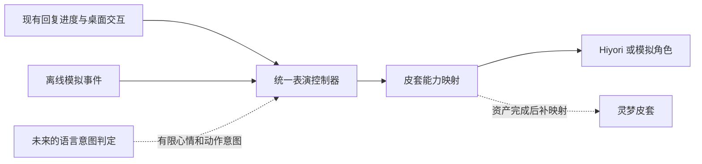

# 表演控制与离线测试台交接

2026-10-04。对应用户“做 1+2，仔细仔细，做好记录”。本次交付把“回复正在做什么”“基础心情是什么”“此刻播放什么短动作”拆开保存，再由统一规则决定显示。皮套未完成时，可以用离线测试台验证这些规则。

完整隔离回归执行 300 项：298 通过，2 项因 Windows 符号链接权限跳过；原生 Hiyori、故障恢复和测试台画面检查通过。中途失败及修正过程保留在验证记录中。

> 发行衔接：本工作包归入 [0.5.0-beta.3](../0.5.0-beta.3修订记录.md)。下文保留开发阶段的提交关系与证据，发行前核对另见修订记录。

## 交付入口

| 内容 | 入口 |
| --- | --- |
| 原实施范围、决策与验收计划 | [PLAN.md](PLAN.md) |
| 工作包 1：控制器、事件协议、优先级、模型适配、未来语言入口 | [controller.md](controller.md) |
| 工作包 2：测试台启动、操作、记录格式、回放边界 | [testbench.md](testbench.md) |
| 测试结果、开发中修正的问题、原生证据与未覆盖范围 | [verification.md](verification.md) |
| 上一轮 main 稳定性修复 | [stability-20261004/README.md](../stability-20261004/README.md) |



## 现在怎样试

完成 README 中的环境准备后，在项目根目录的 PowerShell 打开测试台：

```powershell
& .\.venv\Scripts\python.exe -X utf8 -B tools/performance_lab.py
```

便携环境将解释器替换为 `.\runtime\python.exe`。不需要填写 API key；只使用无界面示例时，任意兼容的标准库 Python 即可。

先载入“喝茶被拖拽打断”或“旧回复迟到”示例，点击播放，查看状态与拒绝理由。然后新建记录，手动设置心情和动作。导出的 JSON 能重新导入，也能在无界面入口复核。详细步骤见测试台说明。

“Hiyori 现有能力”只映射已有动作；它不支持喝茶。喝茶是模拟绘制，用来验证动作调度。可以勾选原生 Hiyori 预览检查现有模型，但它只用于实时操作，回放使用示意角色。

## 本地范围与后续拆分

开发工作目录为 `D:\CXY\AIPet-0.5.0\AIPet-0.5.0\work\main-stability-20261004`，本地分支 `codex/stability-20261004`。公开 main 基线为 `c0da0943e795f5682d715315d3d97a17f7a967d3`；本轮从含前次稳定性修复的 `f3b0d8d` 继续。独立开发阶段 VERSION 保持 `0.5.0-beta.2`，当时未建标签、未推送；后续发行统一为 `0.5.0-beta.3`。

代码按控制器与测试台两个提交拆分，实施计划和最终交接记录另行提交。施工日志只补简短功能条目，实验过程放在本工作包。

| 本地提交 | 内容 | 依赖 |
| --- | --- | --- |
| `1404b4a` | 实施计划与边界 | 前一轮完成状态 `f3b0d8d` |
| `bdf752b` | 工作包 1：控制器、映射、现有桌宠接线、相关测试与协议文档 | 使用前一轮 Live2D 恢复接口 |
| `99bb8ca` | 工作包 2：测试台、记录/回放、示例、相关测试与使用文档 | 工作包 1 |

本交接索引与完整验证记录单独提交，便于之后只取某一工作包时一起携带需要的说明。

移植时，测试台依赖控制器工作包；纯控制核心可以单独使用。如果只取新接线而目标还没有上一轮渲染恢复接口，需要同时移植相应接口，不能只拷贝几处调用。各提交没有加入私人配置、人格、记忆、API key、运行环境、截图或美术工程。

普通桌宠的已有回复生命周期现已接入控制器；没有增加真实模型的情绪判断请求，也没有改脑模型或记忆算法。灵梦运行资产尚待美术交接，本轮未导入或验收。

后续可先由用户验收测试台中的状态规则，再把美术交付的参数与动作填入专属映射；语言意图判定和语音口型分别评估。这样每一步都有独立输入、可见结果和复核记录。
