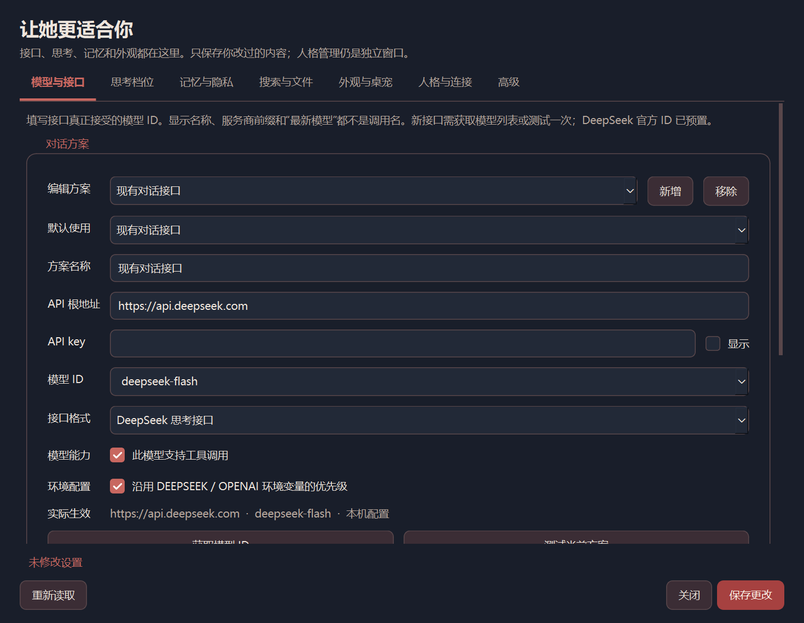

# 配置中心 · 0.6.0-beta.1

在桌宠右键或对话窗口的「···」菜单选择 **设置**。也可以先准备运行环境，再双击 **配置API.bat**；这个入口只打开设置窗口。

## 先接好一个模型

1. 打开「模型与接口」，填写方案名称、API 根地址、API key 和准确的模型 ID。
2. DeepSeek 官方地址是 `https://api.deepseek.com`。截至 2026-10-08，官方调用名为 `deepseek-flash`（DeepSeek-V4.1-Flash）和 `deepseek-v4-pro`（DeepSeek-V4-Pro-0813）；中文产品名、`DeepSeek-V4.1-Flash` 等展示名称不能当作调用名。以[官方模型表](https://api-docs.deepseek.com/zh-cn/quick_start/pricing)及接口实际返回为准。
3. 其他服务选择「标准兼容接口」，地址通常以 `/v1` 结尾，**不要追加 `/chat/completions`**。仅支持兼容 Chat Completions 的接口，不支持直接填写 Responses 或 Anthropic Messages 地址。
4. 点击「获取模型 ID」，直接从该接口返回的列表选择。没有模型列表的服务，可填写其官方 ID 后点击「测试当前方案」。新增或更换的非预置调用名，须通过列表或测试核实才能保存。
5. 在「默认使用」中选好方案，点击「保存更改」。也可以在「思考档位」为某一档选择另一套方案，或单独指定同一接口下的模型 ID。

API key 只负责认证，不会自动选择最新模型。`deepseek-flash` 这样的名称由服务商维护；程序不自动寻找或切换新型号。工具调用能力也由模型决定，不支持时关闭相应选项。

密钥默认隐藏。「实际生效」显示正在编辑方案的地址、模型和配置来源。旧配置继续沿用环境变量优先级；新增方案默认使用自己填写的凭据，只有勾选「沿用环境变量」才接受 `DEEPSEEK_*` / `OPENAI_*` 覆盖。

测试对话只发送固定短句；读图测试只发送程序生成的示例图片，最多请求 64 tokens，可能产生少量费用。读图测试最多等待 60 秒，检查在后台进行，请等结束后再保存或关闭窗口。测试成功说明这次调用成立，不保证该模型支持所有工具和参数；若测试预算被推理耗尽，可先通过模型列表核实 ID。

## 七个标签页

| 标签页 | 可以调整什么 |
|---|---|
| 模型与接口 | 多套地址、密钥、准确模型 ID、默认方案、接口格式、工具能力、环境变量、独立读图接口 |
| 思考档位 | 当前档位、每档模型方案、推理投入、输出及记忆预算、联网方式、采样、自检、篇幅提示、工具名单 |
| 记忆与隐私 | 记忆检索、说话人权重、遗忘系数、整理规则、不保存的敏感词 |
| 搜索与文件 | 文件读写范围、代理、搜索方式、Tavily 密钥与限额、本地资料库 |
| 外观与桌宠 | 当前主题、字号、通透度、Live2D 模型、尺寸和动画选项 |
| 人格与连接 | 打开独立人格管理、本机 QQ 凭据、现有连接的状态入口、资料文件夹 |
| 高级 | 自动选档分数、关键词、面板选项、其他配置组和资料路径 |

每页可以滚动。数字、开关和列表保留原值，未知字段不会因打开窗口而删除。字段提示可在鼠标悬停时查看。Live2D 模型及窗口尺寸需要重启桌宠；通过设置窗口保存的接口、思考、搜索、记忆参数用于之后的请求，已经进行的对话继续使用开始时的模型连接。

DeepSeek 思考模式中，随机性和重复惩罚不会生效；`medium` 与 `high` 都映射为 API 的 `high`。标准兼容接口不发送 DeepSeek 专属思考字段。档位的工具名单会进一步限制本轮可调用工具，留空的受限名单表示全部禁用。

资料库仍需要先建立索引，不能只打开开关。在项目解释器中运行 `src/knowledge.py build`，资料变动后重新建立。开启资料库后，命中的片段会随对话发送给模型服务。普通搜索、Tavily 和文件权限的详细说明见[工具与沙箱](工具与沙箱.md)。

## 人格仍独立管理

原来的「人格管理」入口保留。窗口与设置中心共用当前主题，Windows 字体使用与 Codex 当前系统界面栈一致的 Segoe UI，并提供中文字体回退；字号沿用本机偏好。

人格、情绪文案、行为边界、用户档案分别编辑。切换人格或情绪方案会保留草稿，「保存全部修改」一次保存；关闭时提醒未保存内容。导入 SOUL 仍明确针对选中角色，并先保留旧文件备份。不会因为保存接口而改写人格。

## 保存与私人文件

设置保存在本机的 `data/secrets.json`、`data/thinking.json`、`data/config.json`、`data/appearance.json`。只有改动过的字段才会写入；保存期间若同一字段已在别处修改，会拒绝覆盖并提示重新读取。保存前的旧文件放在 `data/settings_backups/`，其中可能包含密钥，应和其他私人资料一起保留在本机。

`thinking.example.json` 是发行模板，`thinking.json` 是私人选择。打开、关闭或无修改地保存设置不会重置旧配置。现有连接由原连接模块维护，配置窗口不启停网关。

新方案保存在 `secrets.json` 的 `model_profiles` 中，`default_model_profile` 选择默认方案；档位的 `model_profile` 和 `model_override` 可覆盖默认选择。旧的 `deepseek_api_key`、`deepseek_base_url`、`auth_token`、`base_url` 和旧档位模型仍兼容，界面不会自动删除它们。

## 这一版的范围

0.6.0-beta.1 从 `all-round` 单独移入配置模块，未合并整个分支。QQ 同时加入帮助文档、指令面板、格式错误提示和默认关闭的定时符卡。QQ 管理操作仍限主人；[帮助手册](QQ使用帮助.md)、[指令菜单](QQ指令菜单.md)、[定时任务](QQ定时任务.md)分别说明用法。

Windows 窗口与隔离回归已经检查；真实 QQ 收发、所有服务商组合、Mac 和长期常驻仍需后续验收，因此本版保留 beta 标记。
